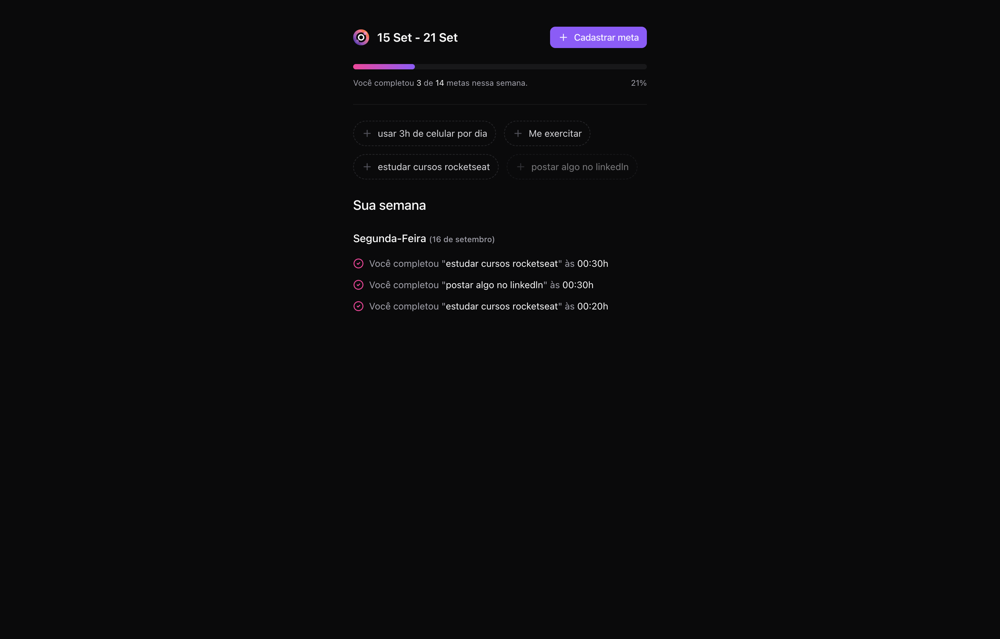
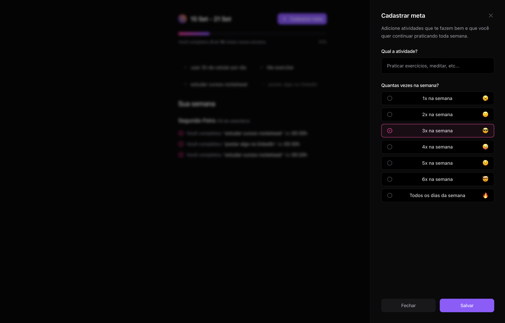

# NLW Pocket Intermediário

Projeto construído do evento Next Level Week da Rocketseat.

  
Project Spoiler

  
  
  
  

## 👨‍💻 Tecnologias

- `ReactJS`
- `CSS`
- `Git` e `Github`
- `TypeScript`
- `Node.js`

## 🔧 Ferramentas

- `VsCode`
- `Figma`

## 💭 O que aprendi?

Este foi um projeto Fullstack, onde fizemos desde o banco de dados (backend)
até o frontend e a integração dos dois. Usamos Postman, Docker e drizzle para armazenamento e manutação do 
banco de dados.
Já para o frontend usamos o auxilio de algumas bibliotecas como por exemplo dayjs, lucide-react e para estilizar
melhor nosso site usamos tailwind CSS.
Este foi um projeto que serviu de treinamento para aprimorar mais ainda conhecimentos em fullstack
e aconteceu em um curso rápido q teve inicio na segunda feira 09 de setembro de 2024 e se encerrou em definitivo
dia 15 de setembro de 2024.

## 📚 Contato

- 📧 Email: lucas.primati@hotmail.com
- 👤 Linkedin: [LinkdeIn](https://www.linkedin.com/in/lucas-primati/)
